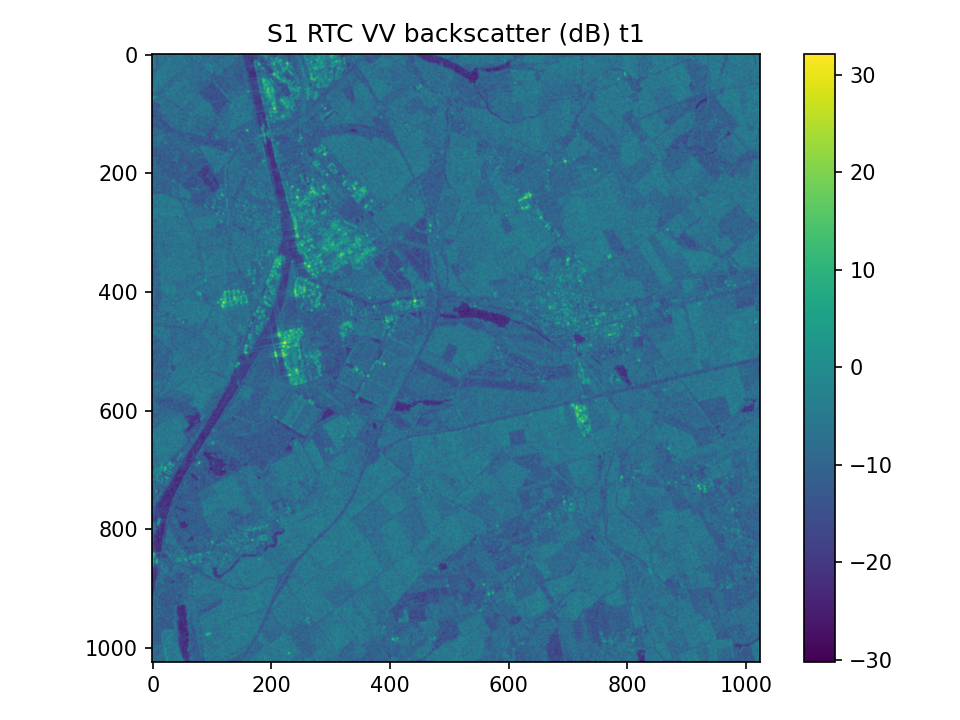
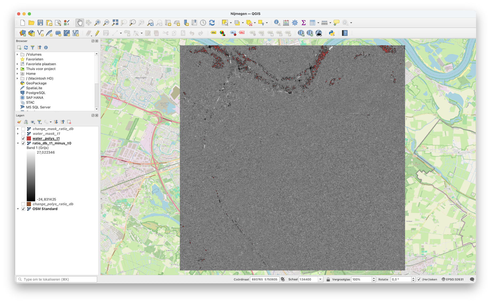

# sar101 — SAR mini‑lab (Sentinel‑1 RTC) with Python (STAC‑native, rasterio)



This repository is a **hands‑on Synthetic Aperture Radar (SAR) mini‑lab** that:

1. Queries **recent Sentinel‑1 Radiometrically Terrain Corrected (RTC)** scenes via a **STAC API** (Microsoft Planetary Computer)
2. Streams scenes **directly as Cloud‑Optimized GeoTIFFs (COGs)** using **STAC‑native HTTP range reads**
3. Converts radar backscatter to **dB**
4. Creates:
   - a simple **water‑like mask** (threshold on backscatter)
   - a **two‑date change detection layer** using a **t1 / t0 ratio in dB**
5. Writes results to:
   - GeoTIFF rasters
   - a GeoPackage with polygonized masks

> The masks and change detection are intentionally simple heuristics.  
> They are meant for **learning and experimentation**, not production flood or damage mapping.

---

## Folder structure

```
sar101/
  src/
    sar101.py                # main pipeline (rasterio, STAC-native)
  outputs/                   # generated artifacts (gitignored)
  docker/
    geoserver/
      docker-compose.yml
      geoserver_data/        # created at runtime
  requirements.txt
  .gitignore
  README.md
```

---

## Outputs

After running the lab you should see:

- `outputs/quicklook_t1_backscatter_db.png`
- `outputs/quicklook_ratio_db_t1_minus_t0.png`
- `outputs/water_mask_t1.tif`
- `outputs/ratio_db_t1_minus_t0.tif`
- `outputs/change_mask_ratio_db.tif`
- `outputs/water_polys_t1.gpkg`
  - layer: `water_polys_t1`
- `outputs/change_polys_ratio_db.gpkg`
  - layer: `change_polys_ratio_db`

---

## Area of interest (AOI)

Default AOI is **around Breda, NL** (lon/lat bbox):

```
[minLon, minLat, maxLon, maxLat] = [4.70, 51.53, 4.90, 51.66]
```

Override with `--bbox`.

---

# 1) Setup

This setup mirrors **modern operational SAR analytics pipelines**:
STAC → COG streaming → rasterio → vectorization → GeoServer.

This project is developed on macOS and does not use `conda`.

### Create a virtual environment

```sh
python3 -m venv .venv
source .venv/bin/activate
python -m pip install -U pip wheel setuptools
python -m pip install -r requirements.txt
```

### Optional (recommended): install GDAL CLI tools

Not required for Python execution, but useful for format conversions (`ogr2ogr`):

```sh
brew update
brew install gdal
```

If you are on Apple Silicon and Homebrew lives in `/opt/homebrew`:

```sh
echo 'eval "$(/opt/homebrew/bin/brew shellenv)"' >> ~/.zprofile
eval "$(/opt/homebrew/bin/brew shellenv)"
```

### Optional: Planetary Computer token

The script automatically signs STAC assets.  
If access issues occur, set:

```sh
export PC_SAS_TOKEN="YOUR_TOKEN"
```

Or use `source .env`, see `sample.env`.

---

# 2) Run the mini‑lab

From the repo root:

```sh
python src/sar101.py
python src/sar101.py --prefer-polarization vv --outdir outputs_vv
python src/sar101.py --prefer-polarization vh --outdir outputs_vh

```

        Common overrides (these match **sar101.py** CLI flags exactly):

        ```sh
        # Look back further in time and consider more candidate scenes
        python src/sar101.py --days 60 --limit 50

        # Explicit AOI (lon/lat bbox)
        python src/sar101.py --bbox 4.70 51.53 4.90 51.66

        # Pick another STAC collection (advanced)
        python src/sar101.py --collection sentinel-1-rtc

        # Prefer polarization (vv or vh); falls back if unavailable
        python src/sar101.py --prefer-polarization vv

        # Tune thresholds
        python src/sar101.py --water-thr-db -22 --change-thr-db 1.5

        # Larger processing window (pixels)
        python src/sar101.py --window-size 2048

        # Write outputs elsewhere
        python src/sar101.py --outdir outputs
        ```

Help:

```sh
python src/sar101.py --help
```

## CLI flags (sar101.py)

```text
--bbox MINLON MINLAT MAXLON MAXLAT   AOI bounding box in lon/lat (EPSG:4326)
--days N                            Lookback window in days
--limit N                           Max STAC items to fetch
--collection NAME                   STAC collection (default: sentinel-1-rtc)
--prefer-polarization {vv,vh}       Preferred polarization asset key
--window-size N                     Square window size to read (pixels)
--water-thr-db X                    Water-like mask threshold on db(t1)
--change-thr-db X                   Change mask threshold on abs(db(t1)-db(t0))
--outdir PATH                       Output directory
```


---

## Change detection logic

Change is computed as:

```
ratio_db = db(t1) - db(t0) = 10 * log10(t1 / t0)
```

A simple **absolute threshold** is applied:

```
abs(ratio_db) > change_thr_db
```

This highlights areas with strong backscatter increase or decrease between acquisitions.

---

# 3) View results

## A) In QGIS

1. Open **QGIS**
2. Drag‑and‑drop:
   - `outputs/water_polys_t1.gpkg`
   - `outputs/change_polys_ratio_db.gpkg`
3. Add layers:
   - `water_polys_t1`
   - `change_polys_ratio_db`
4. Optional:
   - Add raster `outputs/ratio_db_t1_minus_t0.tif` for visual inspection

Tip: apply transparency and add an XYZ basemap (OpenStreetMap) for context.




---

## B) Public free online viewer (geojson.io)

GeoJSON.io does not support GeoPackage directly.

Convert layers first (requires GDAL CLI tools):

```sh
ogr2ogr -f GeoJSON outputs/water_polys_t1.geojson outputs/water_polys_t1.gpkg water_polys_t1
ogr2ogr -f GeoJSON outputs/change_polys_ratio_db.geojson outputs/change_polys_ratio_db.gpkg change_polys_ratio_db
```

Then:

1. Open https://geojson.io
2. Drag‑and‑drop the `.geojson` file

---

# 4) Serve results via GeoServer (Docker)

GeoServer works most reliably with **PostGIS** as a data store.

## Start GeoServer + PostGIS

```sh
cd docker/geoserver
docker compose up -d
```

Endpoints:

- GeoServer UI: http://localhost:8080/geoserver
- PostGIS: `localhost:5432`  
  - database: `gis`
  - user: `gis`
  - password: `gis`

GeoServer credentials (dev):

- user: `admin`
- password: `geoserver`

---

## Load GeoPackage layers into PostGIS

From the repo root (containers running):

```sh
ogr2ogr -f "PostgreSQL"   PG:"host=localhost port=5432 dbname=gis user=gis password=gis"   outputs/water_polys_t1.gpkg   -nln water_polys_t1 -overwrite -lco GEOMETRY_NAME=geom

ogr2ogr -f "PostgreSQL"   PG:"host=localhost port=5432 dbname=gis user=gis password=gis"   outputs/change_polys_ratio_db.gpkg   -nln change_polys_ratio_db -overwrite -lco GEOMETRY_NAME=geom
```

---

## Publish layers in GeoServer

1. Open GeoServer UI → **Stores → Add new Store → PostGIS**
2. Create workspace `sar101`
3. Connection:
   - host: `postgis`
   - port: `5432`
   - database: `gis`
   - user/password: `gis / gis`
4. Save
5. **Layers → Add a new resource**
6. Publish:
   - `water_polys_t1`
   - `change_polys_ratio_db`
7. Use **Layer Preview → OpenLayers**

---

# 5) Notes & troubleshooting

### No scenes found
- Increase `--days`
- Enlarge bbox
- RTC availability varies by orbit and location

### Masks look noisy or wrong
- Tune thresholds:
  - water: `--water-thr-db`
  - change: `--change-thr-db`
- VV vs VH behaves differently; VV is preferred

### Known caveats

#### macOS Fiona GeoPackage append

On some macOS Python environments (depending on how `fiona`/`gdal` binaries are resolved),
**appending multiple layers to a single GeoPackage** can fail with a *NULL pointer error*.

To keep the lab stable and reproducible, the pipeline writes **two separate GeoPackages**:

- `outputs/water_polys_t1.gpkg` (layer `water_polys_t1`)
- `outputs/change_polys_ratio_db.gpkg` (layer `change_polys_ratio_db`)

This is an implementation detail, not a conceptual limitation: you can merge layers later using `ogr2ogr`
once your local stack is known-good.


### Performance
Only a centered window is processed (default 1024×1024).  
Increase `--window-size` if needed.
